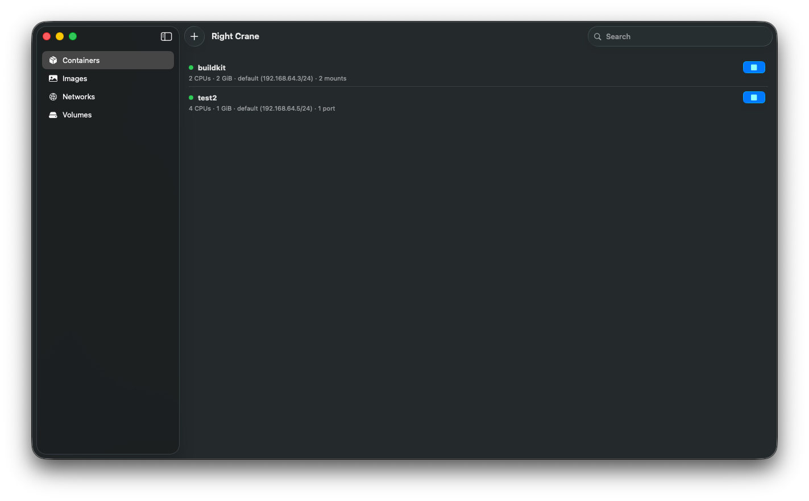

# Apple Containers, with a real UI

Apple's `container` tool brings lightweight, native containerization to macOS — but it ships CLI-only. Crane fills the gap: a polished, purpose-built app that makes container management visual, fast, and Mac-native.

No terminal required. No Electron. No subscription.



## Features

- **Container lifecycle** — Create, start, stop, and remove containers with extensive configuration (ports, volumes, env vars, networks, resource limits, DNS, sysctls, Rosetta)
- **Image building** — Build images from Dockerfiles with an in-app editor and syntax highlighting
- **Image management** — Pull and manage OCI images
- **Volume management** — Create and prune volumes
- **Network management** — Create networks and attach containers
- **Log streaming** — Real-time container logs with per-handle tabs and follow mode
- **Adaptive polling** — Exponential backoff reduces CPU usage when idle, resets on changes
- **Auto service startup** — Automatically starts the container API service on launch
- **Liquid Glass UI** — Native macOS 26 design language

## Requirements

- macOS 26 (Tahoe)
- Apple silicon
- [Apple container cli tool](https://github.com/apple/container)

## Getting Started

- download and install from [https://github.com/glsorre/Crane/releases/latest](https://github.com/glsorre/Crane/releases/latest)

## Building

```sh
xcodebuild -project Crane.xcodeproj -scheme Crane build
```

Or open `Crane.xcodeproj` in Xcode and build normally.

## Contributing

The project is in active development — contributions are welcome.
