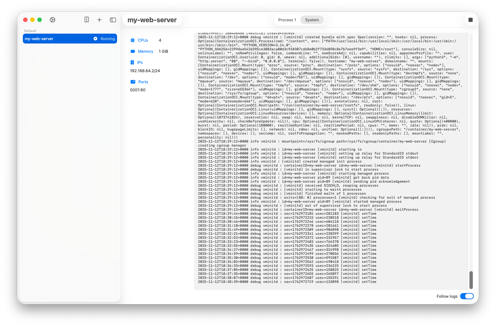

# Crane

Crane is an early phases native MacOS app to manage Apple containers.

## Distribution

Clone the repo and launch it, for now.

## Roadmap

- [X] containers listing grouped by network
- [X] basic containers management (play, stop, remove)
- [X] containers listing polling
- [X] containers logs grouped by handle
- [X] containers logs polling
- [ ] containers creation
- [ ] networks creation
- [ ] images management
- [ ] ...

## Contributing

The product is in the early stages so any contribution is more than welcome.
