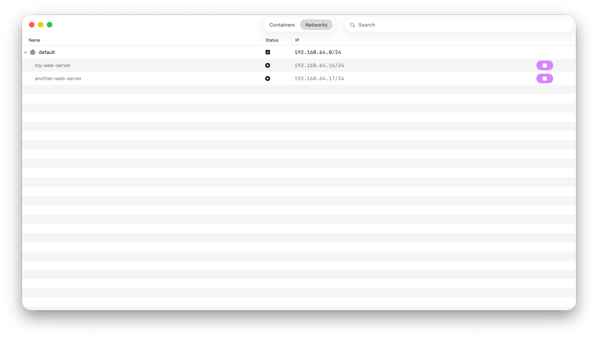
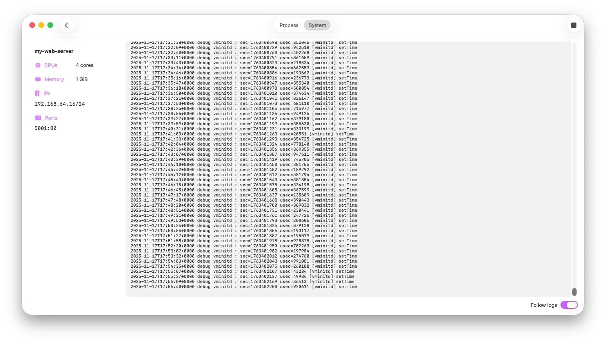
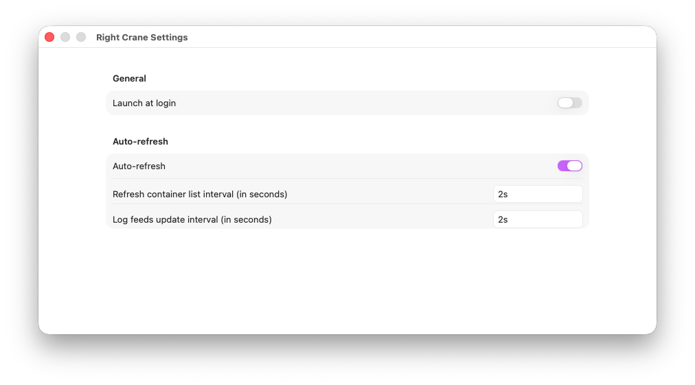

# Crane

Crane is an early phases native MacOS app to manage Apple containers.

## Screenshots

### Containers list

### Networks list

### Container details

### Volumes list

### Settings view

## Roadmap

- [X] containers listing grouped by network
- [X] basic containers management (play, stop, remove)
- [X] containers listing polling
- [X] containers logs grouped by handle
- [X] containers logs polling
- [X] volumes listing
- [ ] images listing
- [ ] volumes creation
- [ ] image fetching
- [ ] networks creation
- [ ] containers creation
- [ ] launch container apiserver at launch
- [ ] ...

## Contributing

The product is in the early stages so any contribution is more than welcome.
